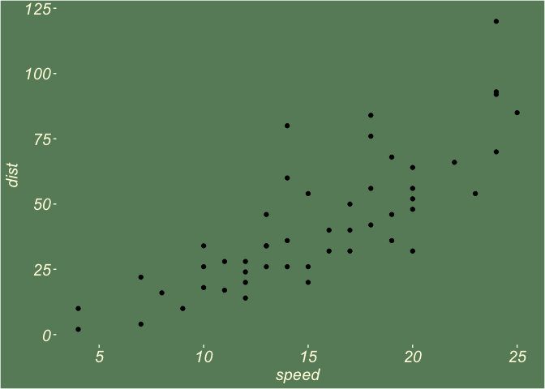
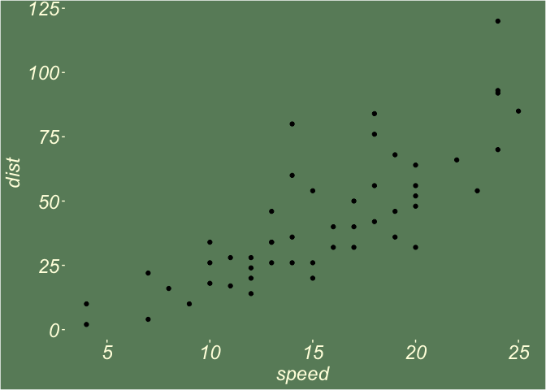
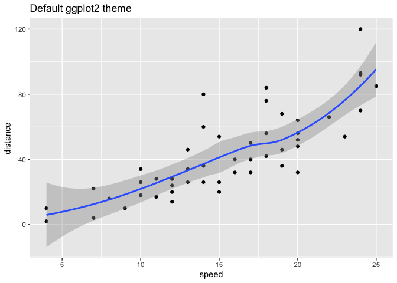
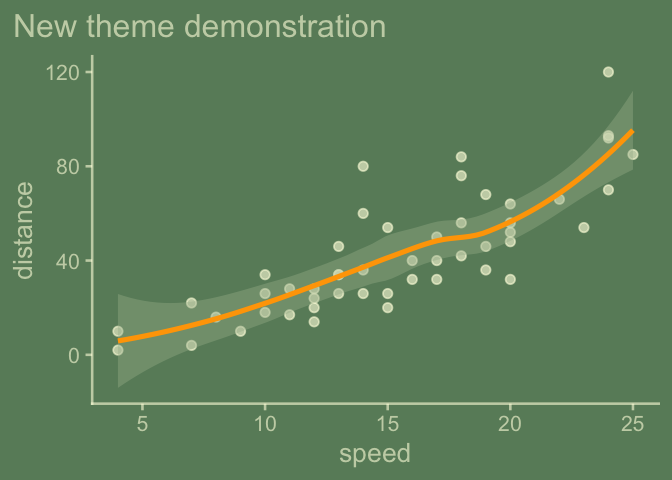
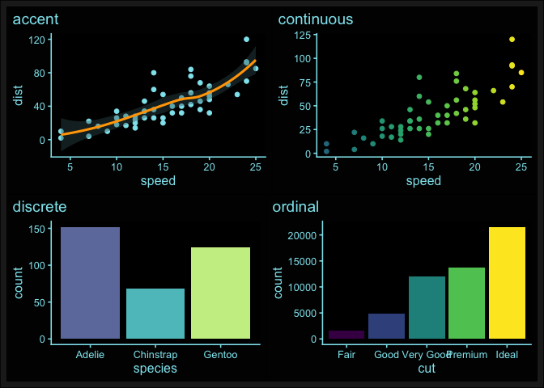
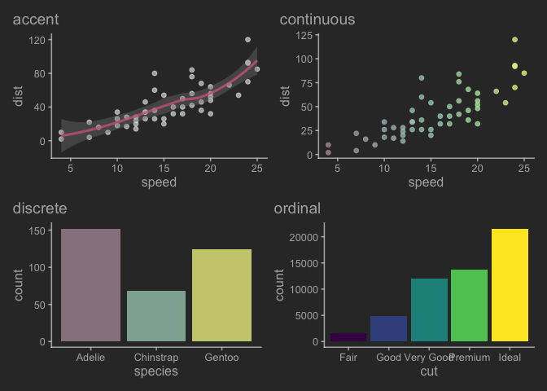

<!-- README.md is generated from README.Rmd. Please edit that file -->

# {ggchalkboard}

``` r
theme_chalkboard <- function(board_color = "darkseagreen4",
                             chalk_color = "lightyellow", ...){

  ggplot2::theme_gray(...) %+replace%
    ggplot2::theme(
      rect = ggplot2::element_rect(fill = board_color,
                                   color = board_color),
      text = ggplot2::element_text(color = chalk_color,
                                   face = "italic",
                                   size = 18),
      panel.background = ggplot2::element_rect(fill = board_color,
                                               color = board_color),
      axis.text = ggplot2::element_text(color = chalk_color),
      axis.ticks = ggplot2::element_line(color = chalk_color),
      panel.grid = ggplot2::element_blank(),
      complete = TRUE)


}
```

### Let’s try it out…

``` r
library(ggplot2)
ggplot(cars) +
  aes(speed, dist) +
  geom_point() 
```



``` r

last_plot() +
  theme_chalkboard()
```



# But who used a sharpie on the chalkboard\!? Layers should be chalk-like too…

We’ll use the ‘update\_geom\_defaults’ function to create a
geoms\_chalk\_on() function, but before we do that, we anticipate
wanting to turn that function back off, to do that, we’ll want to save
ggplot2’s defaults. We save these lists as data in our theme package.
We’ll use these to create geom\_chalk\_off().

Someday, this will be easier… But for now…
<https://github.com/tidyverse/ggplot2/pull/5098>

``` r
## save default lists in a fresh session so that defaults are true to ggplot package defaults
default_aes_point   <- ggplot2::GeomPoint$default_aes
default_aes_segment <- ggplot2::GeomSegment$default_aes
default_aes_rug     <- ggplot2::GeomRug$default_aes
default_aes_rect    <- ggplot2::GeomRect$default_aes
default_aes_bar     <- ggplot2::GeomBar$default_aes
default_aes_label   <- ggplot2::GeomLabel$default_aes

# https://r-pkgs.org/data.htmlf
usethis::use_data(default_aes_point, overwrite = TRUE)
usethis::use_data(default_aes_segment, overwrite = TRUE)
usethis::use_data(default_aes_rug, overwrite = TRUE)
usethis::use_data(default_aes_rect, overwrite = TRUE)
usethis::use_data(default_aes_bar, overwrite = TRUE)
usethis::use_data(default_aes_label, overwrite = TRUE)

# A more general approach
# library("ggplot2")
# library(magrittr)
# 
# Geoms <- ls(pattern = '^Geom', env = as.environment('package:ggplot2'))
# 
# Grab all the default aes for geoms and assign them to value.
# for(i in 1:length(Geoms)){
#   
#   try(assign(paste0("default_aes", Geoms[i]), get(Geoms[i]) %>% .$default_aes))
#   
# }
```

``` r
geoms_chalk_on <- function(color = "lightyellow", fill = color){


  ggplot2::update_geom_defaults("point",   list(colour = color, size = 3.5,    alpha = .75))
  ggplot2::update_geom_defaults("segment", list(colour = color, size = 1.25,   alpha = .75))
  ggplot2::update_geom_defaults("rug",     list(colour = color, size = 1,      alpha = .75))
  ggplot2::update_geom_defaults("rect",    list(colour = color, fill = color, size = 1,      alpha = .75))
  ggplot2::update_geom_defaults("label",   list(fill = fill, color = "grey35", size = 5))
  

  # above is pretty limited... think more generally...  
  # https://stackoverflow.com/questions/21174625/ggplot-how-to-set-default-color-for-all-geoms
  # params <- ls(pattern = '^geom_', env = as.environment('package:ggplot2'))
  # geoms <- gsub("geom_", "", params)
  #
  # lapply(geoms, update_geom_defaults, list(colour = color))
  # lapply(geoms, update_geom_defaults, list(fill = fill))

}
```

``` r
geoms_chalk_off <- function(){

  ggplot2::update_geom_defaults("point",     default_aes_point)
  ggplot2::update_geom_defaults("segment",   default_aes_segment)
  ggplot2::update_geom_defaults("rug",       default_aes_rug)
  ggplot2::update_geom_defaults("rect",      default_aes_rect)
  ggplot2::update_geom_defaults("label",     default_aes_label)

}
```

``` r
geoms_chalk_on()

last_plot() 
```



``` r


geoms_chalk_off()

last_plot() 
```



``` r
theme_chalkboard_slate <- function(...){

  theme_chalkboard("lightskyblue4", "honeydew", ...)

}
```

``` r
geoms_chalk_on()

last_plot() + 
  theme_chalkboard_slate() + 
  ggxmean:::geom_lm() + 
  ggxmean:::geom_lm_residuals()
```



``` r
geoms_chalk_on()

readr::read_csv("https://raw.githubusercontent.com/rfordatascience/tidytuesday/master/data/2024/2024-02-20/isc_grants.csv") |>
  ggplot() + 
  aes(funded) +
  geom_histogram() + 
  theme_chalkboard()
```



# Package this stuff up\!

``` r
readme2pkg::chunk_to_r("theme_chalkboard")
readme2pkg::chunk_to_r("theme_chalkboard_slate")
readme2pkg::chunk_to_r("geoms_chalk_on")
readme2pkg::chunk_to_r("geoms_chalk_off")
readme2pkg::chunk_to_dir("DATASET", dir = "data-raw/")
```
