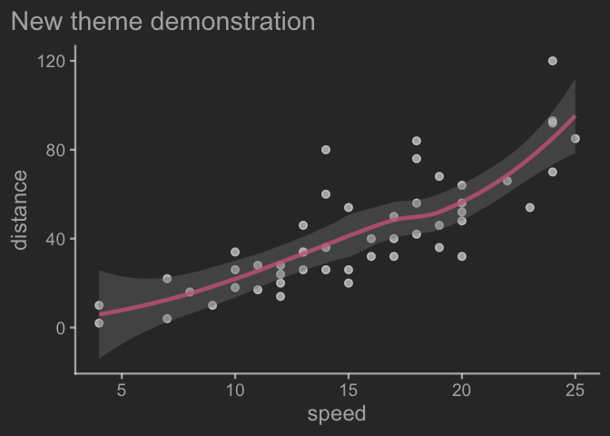
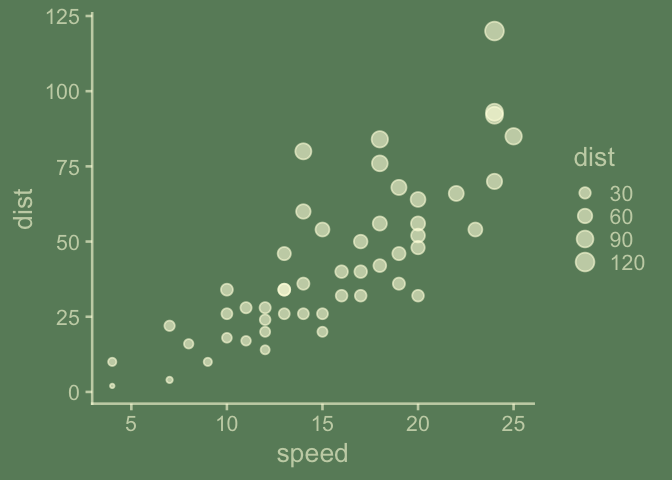

<!-- toc: TRUE -->
<!-- toc_depth: 2 -->
<!-- README.md is generated from README.Rmd. Please edit that file -->
<!-- badges: start -->

[](https://lifecycle.r-lib.org/articles/stages.html#experimental)
<!-- badges: end -->

# {ggchalkboard}

ggchalkboard is a teaching package. It shows examples of how to extend
ggplot2 themes with version 3.5.1.9000, which has some significant
updates - layers (geom\_ and stat\_) colors can be updated within the
theme!

Thematic choices can be ‘make or break’ when it comes to audience. I
don’t consider myself gifted when it comes to thematic choices in
ggplot2, but I do like chalkboards and think we can do a reasonable job
mimicking their look and that more gifted themers might learn from these
efforts! Using the chalkboard theme and its family should say to the
audience, ‘it’s safe to ask questions about this plot; we’re in the
learning phase’

I welcome feedback on the thematic or coding choices.

``` r
library(ggplot2)
```

<!-- But let's not get ahead of ourselves.  Let's start creating by creating theme_chalkboard, which is likely to be familiar as it is a ggplot2 extension entry point.  The topic gets first billing in the ggplot2 extension chapter in ggplot2 and is covered in some detail there, so we won't  https://ggplot2-book.org/extensions  -->

We’ll be modifying a theme, since we don’t want to start from scratch –
a theme contains a lot of decisions; to get a sense of that we can look
at the length of the list object returned by `ggplot2::theme_gray()`

``` r
ggplot2::theme_gray() |> length()
#> [1] 144
```

So let’s get to writing our theme, `theme_chalkboard`.

``` r
theme_classic %>% args()
#> function (base_size = 11, base_family = "", header_family = NULL, 
#>     base_line_size = base_size/22, base_rect_size = base_size/22, 
#>     ink = "black", paper = "white") 
#> NULL

tc <- theme_classic()
```

``` r
theme_classic <- ggplot2::theme_classic

#' @export
theme_chalkboard <- function(paper = "darkseagreen4",
                             ink = alpha("lightyellow", .6),
                             accent = alpha("orange", 1),
                             base_size = 20,
                             base_theme = theme_classic,
                      ...){
  
  base_theme(paper = paper, 
             ink = ink, 
             base_size = base_size, 
             ...) +
    theme(geom = element_geom(accent = accent), 
          text = element_text(face = "plain"),
          plot.title.position = "plot"
          )
  
}
```

``` r
library(tidyverse)
ggplot(cars) + 
  aes(speed, dist) + 
  geom_point() + 
  geom_smooth() + 
  labs(y = "distance") +
  labs(title = "Default ggplot2 theme")

last_plot() + 
  theme_chalkboard() + 
  labs(title = "New theme demonstration")
```


``` r
theme %>% args() %>% head()
#>                                                                                 
#> 1 function (..., line, rect, text, title, point, polygon, geom,                 
#> 2     spacing, margins, aspect.ratio, axis.title, axis.title.x,                 
#> 3     axis.title.x.top, axis.title.x.bottom, axis.title.y, axis.title.y.left,   
#> 4     axis.title.y.right, axis.text, axis.text.x, axis.text.x.top,              
#> 5     axis.text.x.bottom, axis.text.y, axis.text.y.left, axis.text.y.right,     
#> 6     axis.text.theta, axis.text.r, axis.ticks, axis.ticks.x, axis.ticks.x.top,
```

<https://evamaerey.github.io/ggplot2_grammar_guide/themes.html#56>

``` r
element_geom %>% args()
#> function (ink = NULL, paper = NULL, accent = NULL, linewidth = NULL, 
#>     borderwidth = NULL, linetype = NULL, bordertype = NULL, family = NULL, 
#>     fontsize = NULL, pointsize = NULL, pointshape = NULL) 
#> NULL
```

``` r
#' @export
theme_blackboard <- function(paper = "grey20",
                             ink = alpha("whitesmoke", .6),
                             accent = alpha("palevioletred3", .8),
                             base_size = 18,
                             base_theme = theme_chalkboard,
                      ...){
  
  base_theme(paper = paper, ink = ink, base_size = base_size, ...) +
    theme(geom = element_geom(accent = accent))
  
}
```

``` r
last_plot() + 
  theme_blackboard()
```



``` r
#' @export
theme_slateboard <- function(paper = "lightskyblue4",
                             ink = alpha("whitesmoke", .6),
                             accent = alpha("palevioletred3", .8),
                             base_size = 18,
                             base_theme = theme_chalkboard,
                      ...){
  
  base_theme(paper = paper, ink = ink, base_size = base_size, ...) +
    theme(geom = element_geom(accent = accent))
  
}
```

``` r
last_plot() +
  theme_slateboard()
```


``` r
#' @export
theme_whiteboard <- function(paper = "white",
                             ink = alpha("black", .9),
                             accent = alpha("darkred", .9),
                             base_size = 18,
                             base_theme = ggplot2::theme_classic,
                      ...){
  
  base_theme(paper = paper, 
             ink = ink, 
             base_size = base_size, ...) +
    theme(geom = element_geom(accent = accent))
  
}
```

``` r
last_plot() +
  theme_whiteboard()
```


``` r
#' @export
theme_glassboard <- function(paper = alpha("white", 0),
                             ink = alpha("black", .9),
                             accent = alpha("darkred", .9),
                             base_size = 18,
                             base_theme = ggplot2::theme_classic,
                      ...){
  
  base_theme(paper = paper, ink = ink, base_size = base_size, ...) +
    theme(geom = element_geom(accent = accent))
  
}
```

``` r
last_plot() +
  theme_glassboard()
```


# check for colorblindness…

``` r
# remotes::install_github("clauswilke/colorblindr")
colorblindr::cvd_grid(last_plot())
```

<div class="figure">


<p class="caption">
A test with colorblindr
</p>

</div>

# What can be done about layer from a ggplot2 extension that has hard coded aesthetic defaults?

``` r
library(ggplot2)
library(ggalluvial)

GeomStratum$default_aes # hardcoded
#> Aesthetic mapping: 
#> * `size`      -> 0.5
#> * `linewidth` -> 0.5
#> * `linetype`  -> 1
#> * `colour`    -> "black"
#> * `fill`      -> "white"
#> * `alpha`     -> 1

titanic_flat <- data.frame(Titanic)

ggplot(data = titanic_flat) + # Ok Lets look at this titanic data
  aes(y = Freq, axis1 = Sex, axis2 = Survived) + # Here some variables of interest
  ggchalkboard:::theme_chalkboard(base_size = 18) + # in a alluvial plot first look
  geom_alluvium() + # And we are ready to look at flow
  geom_stratum() + # And we can label our stratum axes
  stat_stratum(geom = "text", aes(label = after_stat(stratum))) 
```


``` r

# Step 1.  Look at dynamic default aes from base ggplot2 for reference
GeomRect$default_aes
#> Aesthetic mapping: 
#> * `colour`    -> NA
#> * `fill`      -> `from_theme(col_mix(ink, paper, 0.35))`
#> * `linewidth` -> `from_theme(borderwidth)`
#> * `linetype`  -> `from_theme(bordertype)`
#> * `alpha`     -> NA

# Step 2. Update defaults as required.
GeomStratum$default_aes <- aes(color = from_theme(ggplot2:::col_mix(ink, paper, 0.15)),
                               fill = from_theme(ggplot2:::col_mix(ink, paper, 0.35)),
                               linewidth = from_theme(borderwidth),
                               linetype = from_theme(bordertype),
                               alpha = NA)

# Alternative Step 2  An in-script, alternative could look like this
aes_update <- aes(color = from_theme(ggplot2:::col_mix(ink, paper, 0.15)))
GeomStratum$default_aes <- GeomRect$default_aes |> modifyList(aes_update)

ggplot(data = titanic_flat) + # Ok Lets look at this titanic data
  aes(y = Freq, axis1 = Sex, axis2 = Survived) + # Here some variables of interest
  ggchalkboard:::theme_chalkboard(base_size = 18) + # in a alluvial plot first look
  geom_alluvium() + # And we are ready to look at flow
  geom_stratum() + # And we can label our stratum axes
  stat_stratum(geom = "text", aes(label = after_stat(stratum))) 
```


Further coordination can be done when it comes to scales:

``` r
scale_size_chalkboard <- function(...){
  
  scale_size(range = c(2, 9), ...)
  
}


ggplot2::scale_size
#> function (name = waiver(), breaks = waiver(), labels = waiver(), 
#>     limits = NULL, range = NULL, transform = "identity", trans = deprecated(), 
#>     guide = "legend", aesthetics = "size") 
#> {
#>     palette <- if (!is.null(range)) 
#>         pal_area(range)
#>     else NULL
#>     continuous_scale(aesthetics, palette = palette, name = name, 
#>         breaks = breaks, labels = labels, limits = limits, transform = transform, 
#>         trans = trans, guide = guide)
#> }
#> <bytecode: 0x7f85f1fd8758>
#> <environment: namespace:ggplot2>

ggplot(data = cars) + 
  aes(x = speed, y = dist, size = dist) + 
  geom_point() + 
  theme_chalkboard() 
```



``` r

last_plot() + 
  scale_size_chalkboard()
```


Color and fill scale are probably of greater interest, I know. Something
to come back to.

# Part II. Packaging and documentation 🚧

## Phase 1. Minimal working package

### Bit A. Created package archetecture, running `devtools::create(".")` in interactive session. ✅

``` r
devtools::create(".")
```

### Bit B. Added roxygen skeleton? 🚧

Use a roxygen skeleton for auto documentation and making sure proposed
functions are *exported*. Generally, early on, I don’t do much
(anything) in terms of filling in the skeleton for documentation,
because things may change.

### Bit C. Managed dependencies ? ✅

Package dependencies managed, i.e. `depend::function()` in proposed
functions and declared in the DESCRIPTION

``` r
usethis::use_package("ggplot2")
```

### Bit D. Moved functions R folder? ✅

Use new {readme2pkg} function to do this from readme…

``` r
knitrExtra::chunk_names_get()
#>  [1] "unnamed-chunk-1"           "unnamed-chunk-2"          
#>  [3] "unnamed-chunk-3"           "unnamed-chunk-4"          
#>  [5] "theme_chalkboard"          "unnamed-chunk-5"          
#>  [7] "unnamed-chunk-6"           "unnamed-chunk-7"          
#>  [9] "theme_blackboard"          "unnamed-chunk-8"          
#> [11] "theme_slateboard"          "unnamed-chunk-9"          
#> [13] "theme_whiteboard"          "unnamed-chunk-10"         
#> [15] "theme_glassboard"          "unnamed-chunk-11"         
#> [17] "unnamed-chunk-12"          "unnamed-chunk-13"         
#> [19] "unnamed-chunk-14"          "unnamed-chunk-15"         
#> [21] "unnamed-chunk-16"          "unnamed-chunk-17"         
#> [23] "unnamed-chunk-18"          "unnamed-chunk-19"         
#> [25] "unnamed-chunk-20"          "unnamed-chunk-21"         
#> [27] "unnamed-chunk-22"          "test_calc_times_two_works"
#> [29] "unnamed-chunk-23"          "unnamed-chunk-24"         
#> [31] "unnamed-chunk-25"          "unnamed-chunk-26"         
#> [33] "unnamed-chunk-27"
library(tidyverse)
knitrExtra:::chunk_to_r("theme_chalkboard")
knitrExtra:::chunk_to_r("theme_blackboard")
knitrExtra:::chunk_to_r("theme_whiteboard")
knitrExtra:::chunk_to_r("theme_slateboard")
knitrExtra:::chunk_to_r("theme_glassboard")
```

### Bit E. Run `devtools::check()` and addressed errors. 🚧 ✅

``` r
devtools::check(pkg = ".")
```

### Bit F. Install package 🚧 ✅

``` r
devtools::install(pkg = ".", upgrade = "never") 
```

### Bit G. Write traditional README that uses built package (also serves as a test of build. ✅

The goal of the {ggchalkboard} package is to make it easy to theme
ggplots like chalkboards

Install package with:

    remotes::install_github("EvaMaeRey/ggchalkboard")

Once functions are exported you can remove go to two colons, and when
things are are really finalized, then go without colons (and rearrange
your readme…)

``` r
library(ggchalkboard)  
library(ggplot2)

ggplot(data = cars) + 
  aes(x = speed) + 
  geom_histogram() + 
  ggchalkboard:::theme_chalkboard()
```

### Bit H. Chosen a license? ✅

``` r
usethis::use_mit_license()
```

### Bit I. Add lifecycle badge (experimental) ✅

``` r
usethis::use_lifecycle_badge("experimental")
```

## Phase 2: Listen & iterate 🚧

Try to get feedback from experts on API, implementation, default
decisions. Is there already work that solves this problem?

## Phase 3: Let things settle

### Bit A. Settle on examples. Put them in the roxygen skeleton and readme. 🚧

### Bit B. Written formal tests of functions and save to test that folders 🚧

That would look like this…

``` r
library(testthat)

test_that("calc times 2 works", {
  expect_equal(times_two(4), 8)
  expect_equal(times_two(5), 10)
  
})
```

``` r
knitrExtra:::chunk_to_tests_testthat("test_calc_times_two_works")
```

### Bit C. Added a description and author information in the DESCRIPTION file 🚧

### Bit D. Addressed *all* notes, warnings and errors. 🚧

## Phase 4. Promote to wider audience…

### Bit A. Package website built? ✅

``` r
usethis::use_pkgdown()
pkgdown::build_site()
```

### Bit B. Package website deployed? 🚧 ✅

## Phase 5: Harden/commit

### Submit to CRAN/RUniverse? 🚧

# Appendix: Reports, Environment

## Edit Description file

``` r
readLines("DESCRIPTION")
#>  [1] "Package: ggchalkboard"                              
#>  [2] "Title: What the Package Does (One Line, Title Case)"
#>  [3] "Version: 0.0.0.9000"                                
#>  [4] "Authors@R: "                                        
#>  [5] "    person(given = \"First\","                      
#>  [6] "           family = \"Last\","                      
#>  [7] "           role = c(\"aut\", \"cre\"),"             
#>  [8] "           email = \"first.last@example.com\","     
#>  [9] "           comment = c(ORCID = \"YOUR-ORCID-ID\"))" 
#> [10] "Description: What the package does (one paragraph)."
#> [11] "License: MIT + file LICENSE"                        
#> [12] "Encoding: UTF-8"                                    
#> [13] "LazyData: true"                                     
#> [14] "Roxygen: list(markdown = TRUE)"                     
#> [15] "RoxygenNote: 7.2.3"                                 
#> [16] "Depends: "                                          
#> [17] "    R (>= 2.10)"                                    
#> [18] "Imports: "                                          
#> [19] "    ggplot2"
```

## Environment

Here I just want to print the packages and the versions

``` r
all <- sessionInfo() |> print() |> capture.output()
all[11:20]
#>  [1] ""                                                                                
#>  [2] "time zone: America/Denver"                                                       
#>  [3] "tzcode source: internal"                                                         
#>  [4] ""                                                                                
#>  [5] "attached base packages:"                                                         
#>  [6] "[1] stats     graphics  grDevices utils     datasets  methods   base     "       
#>  [7] ""                                                                                
#>  [8] "other attached packages:"                                                        
#>  [9] " [1] ggalluvial_0.12.5  lubridate_1.9.3    forcats_1.0.0      stringr_1.5.1     "
#> [10] " [5] dplyr_1.1.4        purrr_1.0.2        readr_2.1.5        tidyr_1.3.1       "
```

## `devtools::check()` report

``` r
devtools::check(pkg = ".")
```
