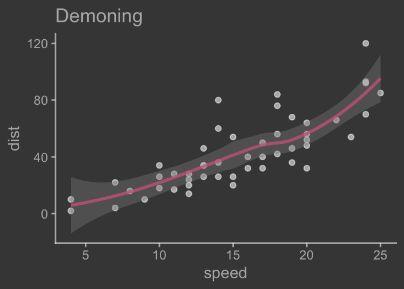
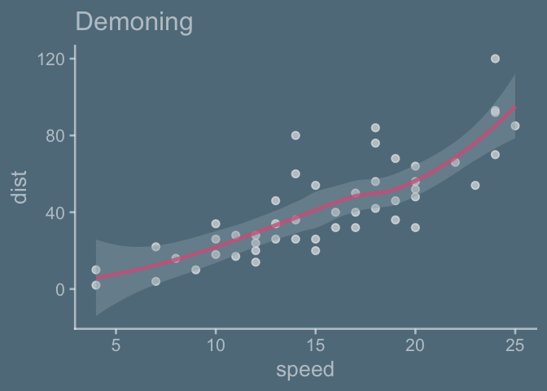
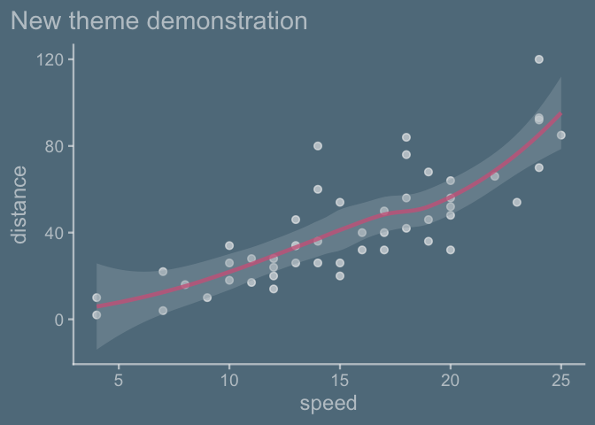

<!-- toc: TRUE -->
<!-- toc_depth: 2 -->
<!-- README.md is generated from README.Rmd. Please edit that file -->
<!-- badges: start -->

[](https://lifecycle.r-lib.org/articles/stages.html#experimental)
<!-- badges: end -->

# {ggchalkboard}

ggchalkboard is a teaching package. It shows examples of how to extend
ggplot2 themes w/ version 3.5.1.9000, which has some significant
updates!

I do not consider myself very gifted when it comes to thematic choices
in ggplot2. But thematic choices can be ‘make or break’ when it comes to
audience. I do like chalkboards and think I can do a reasonable job
mimicking their look and that more gifted themers might learn from these
efforts.

I welcome feedback on the thematic or coding choices.

``` r
library(ggplot2)
```

<!-- But let's not get ahead of ourselves.  Let's start creating by creating theme_chalkboard, which is likely to be familiar as it is a ggplot2 extension entry point.  The topic gets first billing in the ggplot2 extension chapter in ggplot2 and is covered in some detail there, so we won't  https://ggplot2-book.org/extensions  -->

We’ll be modifying a theme, since we don’t want to start from scratch –
a theme contains a lot of decisions; to get a sense of that we can look
at the length of the list object returned by `ggplot2::theme_gray()`

``` r
ggplot2::theme_gray() |> length()
#> [1] 139
```

So let’s get to writing our theme, `theme_chalkboard`.

``` r
theme_classic <- ggplot2::theme_classic

theme_chalkboard <- function(paper = "darkseagreen4",
                             ink = alpha("lightyellow", .6),
                             accent = alpha("orange", 1),
                             base_size = 20,
                             base_theme = theme_classic,
                      ...){
  
  base_theme(paper = paper, ink = ink, base_size = base_size, ...) + 
    theme(geom = element_geom(accent = accent))
  
}
```

``` r
library(tidyverse)
ggplot(cars) + 
  aes(speed, dist) + 
  geom_point() + 
  geom_smooth()
#> `geom_smooth()` using method = 'loess' and formula = 'y ~ x'
```

``` r

last_plot() + 
  theme_chalkboard()
#> `geom_smooth()` using method = 'loess' and formula = 'y ~ x'
```


``` r
theme_blackboard <- function(paper = "grey27",
                             ink = alpha("whitesmoke", .6),
                             accent = alpha("palevioletred3", .8),
                             base_size = 20,
                             inherited = ggplot2::theme_classic,
                      ...){
  
  inherited(paper = paper, ink = ink, base_size = base_size, ...) + 
    theme(geom = element_geom(accent = accent))
  
}
```

``` r
last_plot() + 
  theme_blackboard()
#> `geom_smooth()` using method = 'loess' and formula = 'y ~ x'
```


``` r
theme_slateboard <- function(paper = "lightskyblue4",
                             ink = alpha("whitesmoke", .6),
                             accent = alpha("palevioletred3", .8),
                             base_size = 20,
                             inherited = ggplot2::theme_classic,
                      ...){
  
  inherited(paper = paper, ink = ink, base_size = base_size, ...) + 
    theme(geom = element_geom(accent = accent))
  
}
```

``` r
last_plot() +
  theme_slateboard()
#> `geom_smooth()` using method = 'loess' and formula = 'y ~ x'
```



``` r
theme_whiteboard <- function(paper = "white",
                             ink = alpha("darkslateblue", .9),
                             accent = alpha("darkred", .9),
                             base_size = 20,
                             inherited = ggplot2::theme_classic,
                      ...){
  
  inherited(paper = paper, ink = ink, base_size = base_size, ...) + 
    theme(geom = element_geom(accent = accent))
  
}
```

``` r
last_plot() +
  theme_whiteboard()
#> `geom_smooth()` using method = 'loess' and formula = 'y ~ x'
```



``` r
theme_glassboard <- function(paper = alpha("white", 0),
                             ink = alpha("midnightblue", .9),
                             accent = alpha("darkred", .9),
                             base_size = 20,
                             inherited = ggplot2::theme_classic,
                      ...){
  
  inherited(paper = paper, ink = ink, base_size = base_size, ...) + 
    theme(geom = element_geom(accent = accent))
  
}
```

``` r
last_plot() +
  theme_glassboard()
#> `geom_smooth()` using method = 'loess' and formula = 'y ~ x'
```


Further coordination can be done when it comes to scales:

``` r
scale_size_chalkboard <- function(...){
  
  scale_size(range = c(2, 9), ...)
  
}

ggplot(data = cars) + 
  aes(x = speed, y = dist, size = dist) + 
  geom_point() + 
  theme_chalkboard() + 
  scale_size_chalkboard()
```



Color and fill scale are probably of greater interest, I know. Something
to come back to.

# Part II. Packaging and documentation 🚧

## Phase 1. Minimal working package

### Bit A. Created package archetecture, running `devtools::create(".")` in interactive session. ✅

``` r
devtools::create(".")
```

### Bit B. Added roxygen skeleton? 🚧

Use a roxygen skeleton for auto documentation and making sure proposed
functions are *exported*. Generally, early on, I don’t do much
(anything) in terms of filling in the skeleton for documentation,
because things may change.

### Bit C. Managed dependencies ? ✅

Package dependencies managed, i.e. `depend::function()` in proposed
functions and declared in the DESCRIPTION

``` r
usethis::use_package("ggplot2")
```

### Bit D. Moved functions R folder? ✅

Use new {readme2pkg} function to do this from readme…

``` r
knitrExtra::chunk_names_get()
#> It seems you are currently knitting a Rmd/Qmd file. The parsing of the file will be done in a new R session.
#>  [1] "unnamed-chunk-1"           "unnamed-chunk-2"          
#>  [3] "unnamed-chunk-3"           "theme_chalkboard"         
#>  [5] "unnamed-chunk-4"           "theme_blackboard"         
#>  [7] "unnamed-chunk-5"           "theme_slateboard"         
#>  [9] "unnamed-chunk-6"           "theme_whiteboard"         
#> [11] "unnamed-chunk-7"           "theme_glassboard"         
#> [13] "unnamed-chunk-8"           "unnamed-chunk-9"          
#> [15] "unnamed-chunk-10"          "unnamed-chunk-11"         
#> [17] "unnamed-chunk-12"          "unnamed-chunk-13"         
#> [19] "unnamed-chunk-14"          "unnamed-chunk-15"         
#> [21] "unnamed-chunk-16"          "unnamed-chunk-17"         
#> [23] "test_calc_times_two_works" "unnamed-chunk-18"         
#> [25] "unnamed-chunk-19"          "unnamed-chunk-20"         
#> [27] "unnamed-chunk-21"          "unnamed-chunk-22"
```

``` r
library(tidyverse)
knitrExtra:::chunk_to_r("theme_chalkboard")
#> It seems you are currently knitting a Rmd/Qmd file. The parsing of the file will be done in a new R session.
```

``` r
knitrExtra:::chunk_to_r("theme_blackboard")
#> It seems you are currently knitting a Rmd/Qmd file. The parsing of the file will be done in a new R session.
```

``` r
knitrExtra:::chunk_to_r("theme_whiteboard")
#> It seems you are currently knitting a Rmd/Qmd file. The parsing of the file will be done in a new R session.
```

``` r
knitrExtra:::chunk_to_r("theme_slateboard")
#> It seems you are currently knitting a Rmd/Qmd file. The parsing of the file will be done in a new R session.
```

``` r
knitrExtra:::chunk_to_r("theme_glassboard")
#> It seems you are currently knitting a Rmd/Qmd file. The parsing of the file will be done in a new R session.
```

### Bit E. Run `devtools::check()` and addressed errors. 🚧 ✅

``` r
devtools::check(pkg = ".")
```

### Bit F. Build package 🚧 ✅

``` r
devtools::build()
```

### Bit G. Write traditional README that uses built package (also serves as a test of build. ✅

The goal of the {ggchalkboard} package is to make it easy to theme
ggplots like chalkboards

Install package with:

    remotes::install_github("EvaMaeRey/ggchalkboard")

Once functions are exported you can remove go to two colons, and when
things are are really finalized, then go without colons (and rearrange
your readme…)

``` r
library(ggchalkboard)  
library(ggplot2)

ggplot(data = cars) + 
  aes(x = speed) + 
  geom_histogram() + 
  ggchalkboard:::theme_chalkboard()

ggchalkboard:::geoms_chalk_on()

last_plot()


ggchalkboard:::geoms_chalk_off()

last_plot()
```

### Bit H. Chosen a license? ✅

``` r
usethis::use_mit_license()
```

### Bit I. Add lifecycle badge (experimental) ✅

``` r
usethis::use_lifecycle_badge("experimental")
```

## Phase 2: Listen & iterate 🚧

Try to get feedback from experts on API, implementation, default
decisions. Is there already work that solves this problem?

## Phase 3: Let things settle

### Bit A. Settle on examples. Put them in the roxygen skeleton and readme. 🚧

### Bit B. Written formal tests of functions and save to test that folders 🚧

That would look like this…

``` r
library(testthat)

test_that("calc times 2 works", {
  expect_equal(times_two(4), 8)
  expect_equal(times_two(5), 10)
  
})
```

``` r
knitrExtra:::chunk_to_tests_testthat("test_calc_times_two_works")
```

### Bit C. Added a description and author information in the DESCRIPTION file 🚧

### Bit D. Addressed *all* notes, warnings and errors. 🚧

## Phase 4. Promote to wider audience…

### Bit A. Package website built? ✅

``` r
usethis::use_pkgdown()
pkgdown::build_site()
```

### Bit B. Package website deployed? 🚧 ✅

## Phase 5: Harden/commit

### Submit to CRAN/RUniverse? 🚧

# Appendix: Reports, Environment

## Edit Description file

``` r
readLines("DESCRIPTION")
#>  [1] "Package: ggchalkboard"                              
#>  [2] "Title: What the Package Does (One Line, Title Case)"
#>  [3] "Version: 0.0.0.9000"                                
#>  [4] "Authors@R: "                                        
#>  [5] "    person(given = \"First\","                      
#>  [6] "           family = \"Last\","                      
#>  [7] "           role = c(\"aut\", \"cre\"),"             
#>  [8] "           email = \"first.last@example.com\","     
#>  [9] "           comment = c(ORCID = \"YOUR-ORCID-ID\"))" 
#> [10] "Description: What the package does (one paragraph)."
#> [11] "License: MIT + file LICENSE"                        
#> [12] "Encoding: UTF-8"                                    
#> [13] "LazyData: true"                                     
#> [14] "Roxygen: list(markdown = TRUE)"                     
#> [15] "RoxygenNote: 7.2.3"                                 
#> [16] "Depends: "                                          
#> [17] "    R (>= 2.10)"                                    
#> [18] "Imports: "                                          
#> [19] "    ggplot2"
```

## Environment

Here I just want to print the packages and the versions

``` r
all <- sessionInfo() |> print() |> capture.output()
all[11:20]
#>  [1] ""                                                                                
#>  [2] "time zone: America/Denver"                                                       
#>  [3] "tzcode source: internal"                                                         
#>  [4] ""                                                                                
#>  [5] "attached base packages:"                                                         
#>  [6] "[1] stats     graphics  grDevices utils     datasets  methods   base     "       
#>  [7] ""                                                                                
#>  [8] "other attached packages:"                                                        
#>  [9] " [1] lubridate_1.9.3    forcats_1.0.0      stringr_1.5.1      dplyr_1.1.4       "
#> [10] " [5] purrr_1.0.2        readr_2.1.5        tidyr_1.3.1        tibble_3.2.1      "
```

## `devtools::check()` report

``` r
devtools::check(pkg = ".")
```
