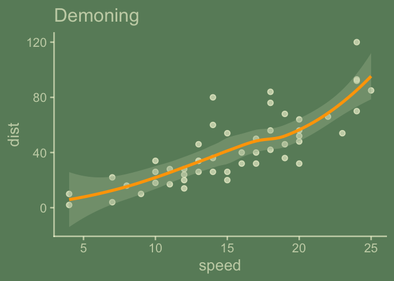
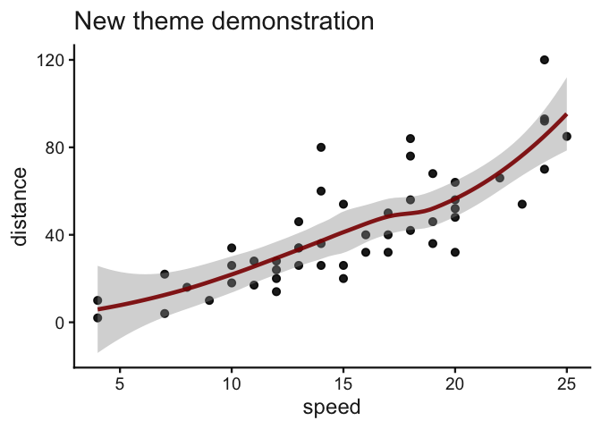
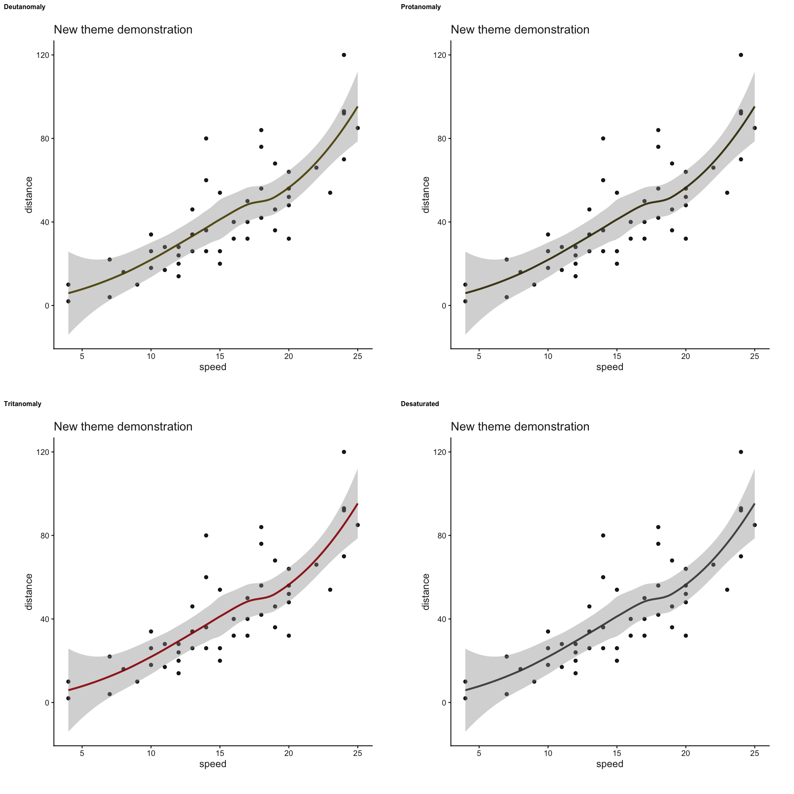
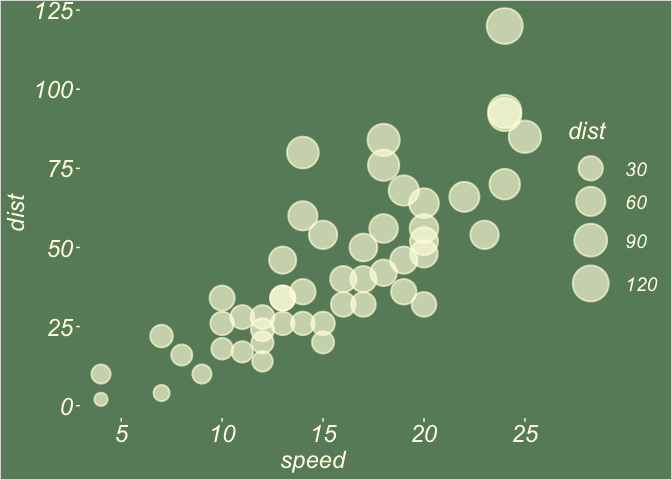

<!-- toc: TRUE -->

<!-- toc_depth: 2 -->

<!-- README.md is generated from README.Rmd. Please edit that file -->

<!-- badges: start -->

[](https://lifecycle.r-lib.org/articles/stages.html#experimental)
<!-- badges: end -->

# {ggchalkboard}

ggchalkboard is an example of a ggplot2 extension theme, which works on
strategies to get to complementary geom/stat defaults
`update_geom_defaults`\! The future looks a bit more coordinated\!

I do not consider myself very gifted when it comes to thematic choices
in ggplot2. But thematic choices can be ‘make or break’ when it comes to
audience. And I do like chalkboards and think I can do a reasonable job
mimicking their look.

This in-progress theme extension package tries to capture some best
practices for creating theme extensions. Unfortunately, due to my
perceived lack of talent for theming, I’m actually pretty new to this
space, so welcome feedback from anybody that has some real expertise to
lend.

What might be new and interesting is the attempted coordination between
aesthetic defaults for geom and stat layers and theme. Below, we see for
example that geom\_point(), being which is defined by the GeomPoint
proto object has the following default aesthetics.

``` r
library(ggplot2)
GeomPoint$default_aes
#> Aesthetic mapping: 
#> * `shape`  -> 19
#> * `colour` -> "black"
#> * `size`   -> 1.5
#> * `fill`   -> NA
#> * `alpha`  -> NA
#> * `stroke` -> 0.5
```

These are sensible starting points. Surely people would question default
color choice of ‘burlywood4’.

But ‘black’ color and 1.5 size defaults may look less sensible in the
context of a great theme that you’ve constructed. So we are going to
tackle that with `update_geom_defaults()` can be used to complement a
new theme function.

But let’s not get ahead of ourselves. Let’s start creating by creating
theme\_chalkboard, which is likely to be familiar as it is a ggplot2
extension entry point. The topic gets first billing in the ggplot2
extension chapter in ggplot2 and is covered in some detail there, so we
won’t <https://ggplot2-book.org/extensions>

We’ll be modifying a theme, since we don’t want to start from scratch –
a theme contains a lot of decisions; to get a sense of that we can look
at the length of the list object returned by `ggplot2::theme_gray()`

``` r
ggplot2::theme_gray() |> length()
#> [1] 114
```

So let’s get to writing our theme, `theme_chalkboard`.

``` r
#' Title
#'
#' @param board_color a string which is a color value
#' @param chalk_color a string which is a color value
#' @param ... 
#'
#' @return a ggplot2 object
#' @export
#'
#' @examples
theme_chalkboard <- function(board_color = "darkseagreen4",
                             chalk_color = "lightyellow", ...){

  ggplot2::theme_gray(...) %+replace%   ##<< we'll piggy back on an existing theme
    ggplot2::theme(
      rect = ggplot2::element_rect(fill = board_color,
                                   color = board_color),
      text = ggplot2::element_text(color = chalk_color,
                                   face = "italic",
                                   size = 18),
      panel.background = ggplot2::element_rect(fill = board_color,
                                               color = board_color),
      axis.text = ggplot2::element_text(color = chalk_color),
      axis.ticks = ggplot2::element_line(color = chalk_color),
      panel.grid = ggplot2::element_blank(),
      complete = TRUE   ##<< important, see 20.1.2 Complete themes in ggplot2 book
      )

}
```

*I think there is likely room for improvement here. Please chime in if
you’d like to alert me to problems and better ways to get things done\!
I especially have hesitations about sizing and relative sizing. Please
excuse my ignorances.*

Let’s try this out\!

``` r
library(ggplot2)
ggplot(cars) +
  aes(speed, dist) +
  geom_point() 
```


``` r

last_plot() +
  theme_chalkboard()
```



This looks pretty good to me\! But … who used a sharpie on the
chalkboard\!? Layers (geoms\_\* and stats\_\*) should be chalk-like too…

## Using `update_geom_defaults` for matching geom/stat layers look and feel of to new theme

### First, experimental cut

We’ll use the ‘update\_geom\_defaults’ function to create a
geoms\_chalk\_on() function, but before we do that, we anticipate
wanting to turn that function back off. To do that, we’ll want to save
ggplot2’s defaults. We save these lists as data in our theme package.
We’ll use these to create geom\_chalk\_off().

Someday, this will be easier… But for now…
<https://github.com/tidyverse/ggplot2/pull/5098>

**This whole strategy might get immediately revised by copying the dev
version of 5098 and using that here**

*Point of interest: the layer-defaults and theme coordination has been
on wish lists for a long time: See
<https://github.com/tidyverse/ggplot2/pull/2749> ‘Allow default geom
aesthetics to be set from theme’*

*This might be the precursor issue:
<https://github.com/tidyverse/ggplot2/issues/2239>*

``` r
## save default lists in a fresh session so that defaults are true to ggplot package defaults
default_aes_point   <- ggplot2::GeomPoint$default_aes
default_aes_segment <- ggplot2::GeomSegment$default_aes
default_aes_rug     <- ggplot2::GeomRug$default_aes
default_aes_rect    <- ggplot2::GeomRect$default_aes
default_aes_bar     <- ggplot2::GeomBar$default_aes
default_aes_label   <- ggplot2::GeomLabel$default_aes

# https://r-pkgs.org/data.htmlf
usethis::use_data(default_aes_point, overwrite = TRUE)
usethis::use_data(default_aes_segment, overwrite = TRUE)
usethis::use_data(default_aes_rug, overwrite = TRUE)
usethis::use_data(default_aes_rect, overwrite = TRUE)
usethis::use_data(default_aes_bar, overwrite = TRUE)
usethis::use_data(default_aes_label, overwrite = TRUE)

# A more general approach
# library("ggplot2")
# library(magrittr)
# 
# Geoms <- ls(pattern = '^Geom', env = as.environment('package:ggplot2'))
# 
# Grab all the default aes for geoms and assign them to value.
# for(i in 1:length(Geoms)){
#   
#   try(assign(paste0("default_aes", Geoms[i]), get(Geoms[i]) %>% .$default_aes))
#   
# }
```

``` r
geoms_chalk_on <- function(chalk_color = "lightyellow", color = NULL, fill = NULL){

  if(is.null(color)){color <- chalk_color}
  if(is.null(fill)){fill <- chalk_color}

  
  ggplot2::update_geom_defaults("point",   list(colour = color, size = 3.5,    alpha = .75))
  ggplot2::update_geom_defaults("segment", list(colour = color, size = 1.25,   alpha = .75))
  ggplot2::update_geom_defaults("rug",     list(colour = color, size = 1,      alpha = .75))
  ggplot2::update_geom_defaults("rect",    list(colour = color, fill = color, size = 1,      alpha = .75))
  ggplot2::update_geom_defaults("label",   list(fill = fill, color = "grey35", size = 5))
  

  # above is pretty limited... think more generally...  
  # the problem with this is that you might want at least as many defaults as base ggplot2.  
  # for example fill colors are grey35, grey20 and white in base ggplot2.  
  # These are pretty good defaults.. So we favor Torsten Sprenger's approach...
  # https://stackoverflow.com/questions/21174625/ggplot-how-to-set-default-color-for-all-geoms
  # params <- ls(pattern = '^geom_', env = as.environment('package:ggplot2'))
  # geoms <- gsub("geom_", "", params)
  # 
  # lapply(geoms, update_geom_defaults, list(colour = color))
  # lapply(geoms, update_geom_defaults, list(fill = fill))

}
```

``` r
geoms_chalk_off <- function(){

  ggplot2::update_geom_defaults("point",     default_aes_point)
  ggplot2::update_geom_defaults("segment",   default_aes_segment)
  ggplot2::update_geom_defaults("rug",       default_aes_rug)
  ggplot2::update_geom_defaults("rect",      default_aes_rect)
  ggplot2::update_geom_defaults("label",     default_aes_label)

}
```

Okay\! Let’s see our geoms\_chalk\_on in action.

``` r
geoms_chalk_on()

last_plot()
```


Very nice\! The points match the look and feel of the theme a lot
better. Okay, and let’s check that we can turn the new defaults back
off.

``` r
geoms_chalk_off()

last_plot() 
```


### Second cut

We just handled a few of the frequently used geoms in our first cut. Now
let’s look more holistically. We’ll use some Torsten Sprenger
contributed code to a stack overflow question. First he has a routine to
look at all the default\_aes for ggplot2 geoms.

We’ll save this as cache\_geoms\_default\_aes.

``` r
library(ggplot2)
library(purrr)

geom_aes_defaults <- function() {
  geom_names <- apropos("^Geom", ignore.case = FALSE)
  geoms <- mget(geom_names, env = asNamespace("ggplot2"))
  map(geoms, ~ .$default_aes)
}

# geom_aes_defaults()
cache_geoms_default_aes <- geom_aes_defaults()
```

The we have this routine to restore geoms to their original default
aesthetics. Hooray\! Yes, the implementation is currently verbose\! 🤷

``` r

geoms_chalk_off <- function(){
  
i = 1  
  
Geom$default_aes               <- cache_geoms_default_aes[["Geom"]]; i <- i+1
GeomAbline$default_aes         <- cache_geoms_default_aes[["GeomAbline"]]; i <- i+1
GeomAnnotationMap$default_aes  <- cache_geoms_default_aes[["AnnotationMap"]]; i <- i+1
GeomArea$default_aes           <- cache_geoms_default_aes[[i]]; i <- i+1
GeomBar$default_aes            <- cache_geoms_default_aes[[i]]; i <- i+1
GeomBlank$default_aes          <- cache_geoms_default_aes[[i]]; i <- i+1
GeomBoxplot$default_aes        <- cache_geoms_default_aes[[i]]; i <- i+1
GeomCol$default_aes            <- cache_geoms_default_aes[[i]]; i <- i+1
GeomContour$default_aes        <- cache_geoms_default_aes[[i]]; i <- i+1
GeomContourFilled$default_aes  <- cache_geoms_default_aes[[i]]; i <- i+1
GeomCrossbar$default_aes       <- cache_geoms_default_aes[[i]]; i <- i+1
GeomCurve$default_aes          <- cache_geoms_default_aes[[i]]; i <- i+1
GeomCustomAnn$default_aes      <- cache_geoms_default_aes[[i]]; i <- i+1
GeomDensity$default_aes        <- cache_geoms_default_aes[[i]]; i <- i+1
GeomDensity2d$default_aes      <- cache_geoms_default_aes[[i]]; i <- i+1
GeomDensity2dFilled$default_aes<- cache_geoms_default_aes[[i]]; i <- i+1
GeomDotplot$default_aes        <- cache_geoms_default_aes[[i]]; i <- i+1
GeomErrorbar$default_aes       <- cache_geoms_default_aes[[i]]; i <- i+1
GeomErrorbarh$default_aes      <- cache_geoms_default_aes[[i]]; i <- i+1
GeomFunction$default_aes       <- cache_geoms_default_aes[[i]]; i <- i+1
GeomHex$default_aes            <- cache_geoms_default_aes[[i]]; i <- i+1
GeomHline$default_aes          <- cache_geoms_default_aes[[i]]; i <- i+1
GeomLabel$default_aes          <- cache_geoms_default_aes[[i]]; i <- i+1
GeomLine$default_aes           <- cache_geoms_default_aes[[i]]; i <- i+1
GeomLinerange$default_aes      <- cache_geoms_default_aes[[i]]; i <- i+1
GeomLogticks$default_aes       <- cache_geoms_default_aes[[i]]; i <- i+1
GeomMap$default_aes            <- cache_geoms_default_aes[[i]]; i <- i+1
GeomPath$default_aes           <- cache_geoms_default_aes[[i]]; i <- i+1
GeomPoint$default_aes          <- cache_geoms_default_aes[[i]]; i <- i+1
GeomPointrange$default_aes     <- cache_geoms_default_aes[[i]]; i <- i+1
GeomPolygon$default_aes        <- cache_geoms_default_aes[[i]]; i <- i+1
GeomQuantile$default_aes       <- cache_geoms_default_aes[[i]]; i <- i+1
GeomRaster$default_aes         <- cache_geoms_default_aes[[i]]; i <- i+1
GeomRasterAnn$default_aes      <- cache_geoms_default_aes[[i]]; i <- i+1
GeomRect$default_aes           <- cache_geoms_default_aes[[i]]; i <- i+1
GeomRibbon$default_aes         <- cache_geoms_default_aes[[i]]; i <- i+1
GeomRug$default_aes            <- cache_geoms_default_aes[[i]]; i <- i+1
GeomSegment$default_aes        <- cache_geoms_default_aes[[i]]; i <- i+1
GeomSf$default_aes             <- cache_geoms_default_aes[[i]]; i <- i+1
GeomSmooth$default_aes         <- cache_geoms_default_aes[[i]]; i <- i+1
GeomSpoke$default_aes          <- cache_geoms_default_aes[[i]]; i <- i+1
GeomStep$default_aes           <- cache_geoms_default_aes[[i]]; i <- i+1
GeomText$default_aes           <- cache_geoms_default_aes[[i]]; i <- i+1
GeomTile$default_aes           <- cache_geoms_default_aes[[i]]; i <- i+1
GeomViolin$default_aes         <- cache_geoms_default_aes[[i]]; i <- i+1
GeomVline$default_aes          <- cache_geoms_default_aes[[i]]; i <- i+1
  
} 
```

Then we’ll use another Torsten Sprenger solution which I think gets at
what people probably really want for theme and layer visual harmony.
This allows us to go in and change out **values** across geoms. So we
can say things like `new_black = "orange"`. The update\_geom\_default
from ggplot2 is doing some heavy lifting for us too.

``` r
replace_geom_aes_defaults <- function(name, old_aes, new_aes) {
  
  matching_geoms <- 
    map(geom_aes_defaults(), name) %>%
      compact() %>%
      keep(~ !is.na(.) & . == old_aes)
  
  geoms <- gsub("^Geom(.*)", "\\1", names(matching_geoms))
  
  walk(geoms, update_geom_defaults, setNames(list(new_aes), name))
  
}
```

We’ll put Sprenger’s replace\_geom\_aes\_defaults into a user-facing
function geoms\_chalk\_on. In this function, you can follow on all the
thoughtful decision making that was made in base ggplot2 in terms of
variety of color to make a compelling plot. For example ggplot2 uses
black but also two (maybe more) shades of gray. The chalk on function
invites you to think about replacements for each of these values.

There’s a little bit of danger to this approach in that you are changing
defaults throughout, and then you might base a new change on a minor
change. I’m not expressing this well, but say you’re new black color is
‘white’, an then your new “white” color is ‘magenta’, you’ll get
magenta throughout, I think. Darn that is a sad state of affairs, but
I’m not going to worry about it for now.

``` r
geoms_chalk_on <- function(chalk_color = "lightyellow",
                           board_color = "darkseagreen4",
                           new_black = chalk_color, 
                           new_grey20 = chalk_color, 
                           new_grey35 = chalk_color,
                           new_white = board_color,
                           new_linewidth0.5 = 1, 
                           new_linewidth0.1 = .3,
                           new_alpha = .65, 
                           new_linetype = 1,
                           new_size1.5 = 4,
                           new_size0.5 = 1.25,
                           new_stroke0.5 = 1){
  
geoms_chalk_off()  # restore defaults, so that we are working from the default values

replace_geom_aes_defaults("colour", "black", ggplot2::alpha(new_black, new_alpha))
replace_geom_aes_defaults("fill", "black", ggplot2::alpha(new_black, new_alpha))

replace_geom_aes_defaults("colour", "white", ggplot2::alpha(new_white, new_alpha))
replace_geom_aes_defaults("fill", "white", ggplot2::alpha(new_white, new_alpha))

replace_geom_aes_defaults("colour", "grey20", ggplot2::alpha(new_grey20, new_alpha))
replace_geom_aes_defaults("fill", "grey20", ggplot2::alpha(new_grey20, new_alpha))

replace_geom_aes_defaults("colour", "grey35", ggplot2::alpha(new_grey35, new_alpha))
replace_geom_aes_defaults("fill", "grey35", ggplot2::alpha(new_grey35, new_alpha))

replace_geom_aes_defaults("linewidth", 0.5, new_linewidth0.5)
replace_geom_aes_defaults("linewidth", 0.1, new_linewidth0.1)

replace_geom_aes_defaults("alpha", 1, new_alpha)

replace_geom_aes_defaults("linetype", 1, new_linetype)
replace_geom_aes_defaults("size", 1.5, new_size1.5)
replace_geom_aes_defaults("size", 0.5, new_size0.5)
replace_geom_aes_defaults("stroke", 0.5, new_stroke0.5)


}
```

Okay\! Let’s see our geoms\_chalk\_on in action.

``` r
geoms_chalk_on()

last_plot()
```



Very nice\! The points match the look and feel of the theme a lot
better. Okay, and let’s check that we can turn the new defaults back
off.

``` r
geoms_chalk_off()

last_plot() 
```



Great, it’s working\!

### Future cut, use dev version of update\_geom\_defaults?

Here’s a copy paste of this code…

``` r
cache_geom_defaults <- new.env(parent = emptyenv())
cache_stats_defaults <- new.env(parent = emptyenv())

#' Modify geom/stat aesthetic defaults for future plots
#'
#' @param stat,geom Name of geom/stat to modify (like `"point"` or `"bin"`),
#'   or a Geom/Stat object (like `GeomPoint` or `StatBin`).
#' @param new Named list of aesthetics. Alternatively, `NULL` to reset the
#'   defaults.
#' @keywords internal
#' @name update_defaults
#' @export
#' @examples
#' # updating a geom's default aesthetic settings
#' # example: change geom_point()'s default color
#' GeomPoint$default_aes
#' update_geom_defaults("point", aes(color = "red"))
#' GeomPoint$default_aes
#' ggplot(mtcars, aes(mpg, wt)) + geom_point()
#'
#' # Reset defaults by using `new = NULL`
#' update_geom_defaults("point", NULL)
#'
#' # updating a stat's default aesthetic settings
#' # example: change stat_bin()'s default y-axis to the density scale
    @@ -29,27 + 31,63 @@
#'   geom_function(fun = dnorm, color = "red")
#'
#' # reset default
#' update_stat_defaults("bin", NULL)

#' @rdname update_defaults
dev_update_geom_defaults <- function(geom, new) {
  if (is.null(new)) {

    vec_assert(geom, character(), 1)
    old <- cache_geom_defaults[[geom]]
    if (!is.null(old)) {
      new <- update_geom_defaults(geom, old)
      env_unbind(cache_geom_defaults, geom)
    }
    invisible(new)

  } else {

    g <- check_subclass(geom, "Geom", env = parent.frame())
    old <- g$default_aes
    # Only update cache the first time
    if (!geom %in% ls(cache_geom_defaults)) {
      cache_geom_defaults[[geom]] <- old
    }
    new <- rename_aes(new)
    new_names_order <- unique(c(names(old), names(new)))
    new <- defaults(new, old)[new_names_order]
    g$default_aes[names(new)] <- new
    invisible(old)

  }
}
```

# Derivitive functions: slate chalkboard

While we are here, let’s write a couple of derivative functions for a
slightly different chalkboard look.

``` r
theme_chalkboard_slate <- function(...){

  theme_chalkboard(board_color = "lightskyblue4", chalk_color = "honeydew", ...)

}

geoms_chalk_on_slate <- function(chalk_color = "honeydew", ...){
  
  geoms_chalk_on(chalk_color = chalk_color, ...)
  
}
```

``` r
geoms_chalk_on_slate()

last_plot() + 
  theme_chalkboard_slate() + 
  ggxmean:::geom_lm() + 
  ggxmean:::geom_lm_residuals()
```


Further coordination can be done when it comes to scales:

``` r
scale_size_chalkboard <- function(...){
  
  scale_size(range = c(4, 12), ...)
  
}

geoms_chalk_on()

ggplot(data = cars) + 
  aes(x = speed, y = dist, size = dist) + 
  geom_point() + 
  theme_chalkboard() + 
  scale_size_chalkboard()
```



Color and fill scale are probably of greater interest, I know. Something
to come back to.

# Part II. Packaging and documentation 🚧

## Phase 1. Minimal working package

### Bit A. Created package archetecture, running `devtools::create(".")` in interactive session. ✅

``` r
devtools::create(".")
```

### Bit B. Added roxygen skeleton? 🚧

Use a roxygen skeleton for auto documentation and making sure proposed
functions are *exported*. Generally, early on, I don’t do much
(anything) in terms of filling in the skeleton for documentation,
because things may change.

### Bit C. Managed dependencies ? ✅

Package dependencies managed, i.e. `depend::function()` in proposed
functions and declared in the DESCRIPTION

``` r
usethis::use_package("ggplot2")
```

### Bit D. Moved functions R folder? ✅

Use new {readme2pkg} function to do this from readme…

``` r
library(tidyverse)
readme2pkg::chunk_to_r("theme_chalkboard")
readme2pkg::chunk_to_r("theme_chalkboard_slate")
readme2pkg::chunk_to_r("geoms_chalk_on")
readme2pkg::chunk_to_r("geoms_chalk_off")
readme2pkg::chunk_to_dir("DATASET", dir = "data-raw/")
```

### Bit E. Run `devtools::check()` and addressed errors. 🚧 ✅

``` r
devtools::check(pkg = ".")
```

### Bit F. Build package 🚧 ✅

``` r
devtools::build()
```

### Bit G. Write traditional README that uses built package (also serves as a test of build. ✅

The goal of the {ggchalkboard} package is to make it easy to theme
ggplots like chalkboards

Install package with:

    remotes::install_github("EvaMaeRey/ggchalkboard")

Once functions are exported you can remove go to two colons, and when
things are are really finalized, then go without colons (and rearrange
your readme…)

``` r
library(ggchalkboard)  
library(ggplot2)

ggplot(data = cars) + 
  aes(x = speed) + 
  geom_histogram() + 
  ggchalkboard:::theme_chalkboard()

ggchalkboard:::geoms_chalk_on()

last_plot()


ggchalkboard:::geoms_chalk_off()

last_plot()
```

### Bit H. Chosen a license? ✅

``` r
usethis::use_mit_license()
```

### Bit I. Add lifecycle badge (experimental) ✅

``` r
usethis::use_lifecycle_badge("experimental")
```

## Phase 2: Listen & iterate 🚧

Try to get feedback from experts on API, implementation, default
decisions. Is there already work that solves this problem?

## Phase 3: Let things settle

### Bit A. Settle on examples. Put them in the roxygen skeleton and readme. 🚧

### Bit B. Written formal tests of functions and save to test that folders 🚧

That would look like this…

``` r
library(testthat)

test_that("calc times 2 works", {
  expect_equal(times_two(4), 8)
  expect_equal(times_two(5), 10)
  
})
```

``` r
readme2pkg::chunk_to_tests_testthat("test_calc_times_two_works")
```

### Bit C. Added a description and author information in the DESCRIPTION file 🚧

### Bit D. Addressed *all* notes, warnings and errors. 🚧

## Phase 4. Promote to wider audience…

### Bit A. Package website built? ✅

``` r
usethis::use_pkgdown()
pkgdown::build_site()
```

### Bit B. Package website deployed? 🚧 ✅

## Phase 5: Harden/commit

### Submit to CRAN/RUniverse? 🚧

# Appendix: Reports, Environment

## Edit Description file

``` r
readLines("DESCRIPTION")
#>  [1] "Package: ggchalkboard"                              
#>  [2] "Title: What the Package Does (One Line, Title Case)"
#>  [3] "Version: 0.0.0.9000"                                
#>  [4] "Authors@R: "                                        
#>  [5] "    person(given = \"First\","                      
#>  [6] "           family = \"Last\","                      
#>  [7] "           role = c(\"aut\", \"cre\"),"             
#>  [8] "           email = \"first.last@example.com\","     
#>  [9] "           comment = c(ORCID = \"YOUR-ORCID-ID\"))" 
#> [10] "Description: What the package does (one paragraph)."
#> [11] "License: MIT + file LICENSE"                        
#> [12] "Encoding: UTF-8"                                    
#> [13] "LazyData: true"                                     
#> [14] "Roxygen: list(markdown = TRUE)"                     
#> [15] "RoxygenNote: 7.2.3"                                 
#> [16] "Depends: "                                          
#> [17] "    R (>= 2.10)"                                    
#> [18] "Imports: "                                          
#> [19] "    ggplot2"
```

## Environment

Here I just want to print the packages and the versions

``` r
all <- sessionInfo() |> print() |> capture.output()
all[11:20]
#>  [1] ""                                                                         
#>  [2] "attached base packages:"                                                  
#>  [3] "[1] stats     graphics  grDevices utils     datasets  methods   base     "
#>  [4] ""                                                                         
#>  [5] "other attached packages:"                                                 
#>  [6] " [1] lubridate_1.9.2      forcats_1.0.0        stringr_1.5.0       "      
#>  [7] " [4] dplyr_1.1.0          purrr_1.0.1          readr_2.1.4         "      
#>  [8] " [7] tidyr_1.3.0          tibble_3.2.1         ggplot2_3.4.4.9000  "      
#>  [9] "[10] tidyverse_2.0.0.9000"                                                
#> [10] ""
```

## `devtools::check()` report

``` r
devtools::check(pkg = ".")
```
