# Intro: {ggchalkboard}

- [Intro: {ggchalkboard}](#intro-ggchalkboard)
  - [Where we are headed:](#where-we-are-headed)
  - [Getting started:
    `theme_whiteboard()`](#getting-started-theme_whiteboard)
  - [Color palette adjustments for
    `theme_chalkboard()`](#color-palette-adjustments-for-theme_chalkboard)
- [Derivative themes: blackboard, slateboard, glassboard
  …](#derivative-themes-blackboard-slateboard-glassboard-)
- [Minimal working package](#minimal-working-package)
  - [Moved functions R folder](#moved-functions-r-folder)
  - [check and install](#check-and-install)
- [More considerations](#more-considerations)
  - [colorblindness colorblindr](#colorblindness-colorblindr)
  - [looking to the future… consider Joseph Lamarange’s work!?
    `safe_pal`](#looking-to-the-future-consider-joseph-lamaranges-work-safe_pal)
  - [Considerations for extenders…](#considerations-for-extenders)

ggchalkboard is a teaching package, where you can browse the source code
right from the readme and package homepage! It shows examples of how to
extend ggplot2 themes with version 4.0.0 which has some significant
updates.

1.  4.0.0 also introduces `ink` (the black of points in default theme),
    `paper` (the white background), and `accent` (the blue in
    [`geom_smooth()`](https://ggplot2.tidyverse.org/reference/geom_smooth.html),
    and a few other geoms).

2.  *Geom* aesthetics can be updated via
    [`theme()`](https://ggplot2.tidyverse.org/reference/theme.html)! 🥳

3.  Some scales can be updated via theme including discrete and
    continuous color (and fill) scales.

Thematic choices can be ‘make or break’ when it comes to audience. I
don’t consider myself gifted when it comes to thematic choices in
ggplot2, but I do like chalkboards and think we can do a reasonable job
mimicking their look and that more gifted themers might learn from these
efforts! Using the chalkboard theme and its family should say to the
audience, ‘it’s safe to ask questions about this plot; we’re in the
learning phase’

I welcome feedback on the thematic or coding choices.

## Where we are headed:

``` r
library(ggplot2)
library(ggchalkboard)

ggplot(cars) + 
  aes(speed, dist) + 
  geom_point() + 
  geom_smooth() + 
  labs(y = "distance") +
  labs(title = "Default ggplot2 theme")

last_plot() + 
  theme_chalkboard() + 
  labs(title = "New chalkboard theme")
```

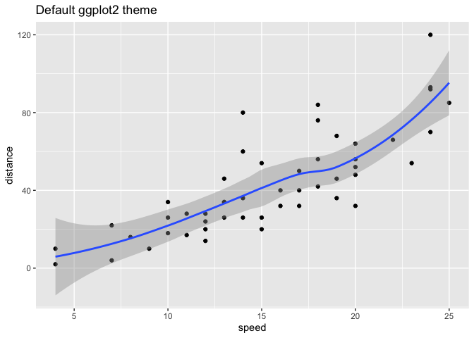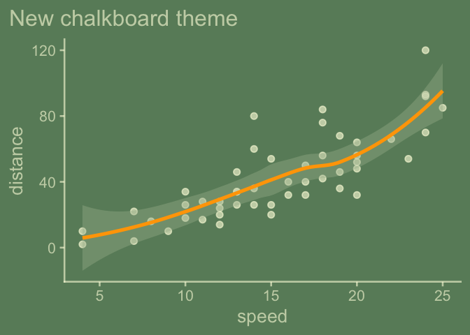

We’ll be modifying a theme, since we don’t want to start from scratch –
a theme contains a lot of decisions; to get a sense of that we can look
at the length of the list object returned by
[`ggplot2::theme_gray()`](https://ggplot2.tidyverse.org/reference/ggtheme.html)

``` r
ggplot2::theme_gray() |> length()
#> [1] 144
```

## Getting started: `theme_whiteboard()`

So let’s get to writing. We’ll start with theme_whiteboard.

``` r
#' @export
theme_whiteboard <- function(base_size = 18,
    base_theme = ggplot2::theme_classic,
    paper = "whitesmoke",
    ink = "grey20",
    accent = alpha("darkred", .7),
    palette.colour.continuous = "plasma",
    palette.fill.continuous = "plasma",
    palette.colour.discrete = "plasma",
    palette.fill.discrete = "plasma",
                      ...){
  
 base_theme(base_size = base_size, 
            paper = paper, 
             ink = ink, 
             accent = accent,
             ...) %+replace%
    theme(plot.title.position = "plot", 
          palette.colour.continuous = palette.colour.continuous, 
          palette.fill.continuous = palette.fill.continuous,
          palette.colour.discrete = palette.colour.discrete,
          palette.fill.discrete = palette.fill.discrete
          # palette.fill.ordinal = palette.colour.discrete,  # wish list
          # palette.fill.ordinal = palette.fill.discrete 
          )
  
}
```

``` r
ggplot(cars) + 
  aes(speed, dist) + 
  geom_point() + 
  geom_smooth() + 
  labs(y = "distance") +
  theme_whiteboard()
```

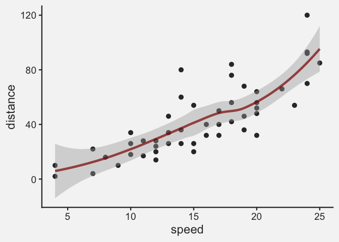

``` r

last_plot() + 
  theme_whiteboard(base_theme = theme_minimal)
```

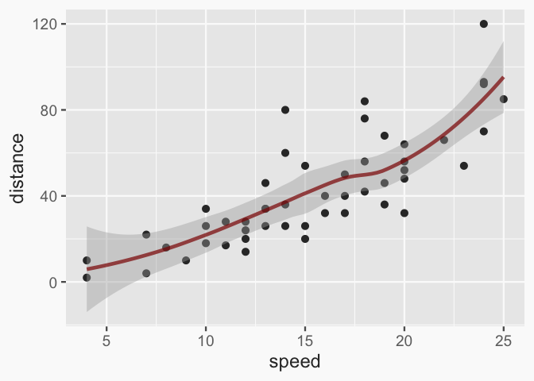

``` r
p1 <- ggplot(cars) +
  aes(speed, dist) +
  geom_point() +
  geom_smooth() + 
  labs(title = "accent")

p2 <- ggplot(cars) +
  aes(speed, dist) +
  geom_point() +
  aes(color = speed) + 
  labs(title = "continuous")

p3 <- ggplot(penguins) + 
  aes(x = species, 
      fill = species) + 
  geom_bar() + 
  labs(title = "discrete")

p4 <- ggplot(diamonds) + 
  aes(x = cut, 
      fill = cut) + 
  geom_bar() + 
  labs(title = "ordinal (not yet accessible from theme)")

library(patchwork)
patchwork_ensemble <- 
  (p1 + p2) / (p3 + p4) & 
  theme(legend.position = "none") 
```

``` r
theme_set(theme_whiteboard(base_size = 10))
patchwork_ensemble
```

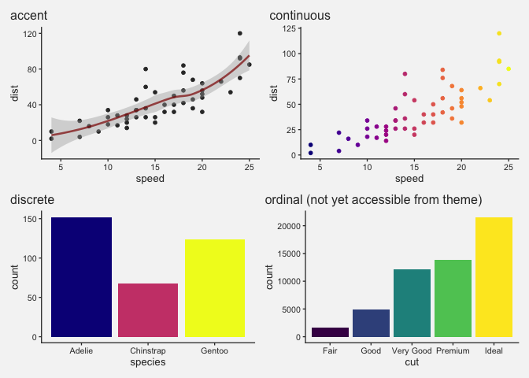

## Color palette adjustments for `theme_chalkboard()`

``` r
# color mixed continuous viridis pal
viridis_pal_c <- function(alpha = 1, begin = 0, end = 1, direction = 1, 
                          option = "viridis", colmix = "white", amount = 0){
  
  scales::pal_gradient_n(
    scales::pal_viridis(alpha = alpha, 
                        begin = begin, 
                        end = end, 
                        direction = direction, 
                        option = option)(6) |>
      scales::col_mix(colmix, amount), 
    values = NULL, 
    space = "Lab")
  
}

viridis_c_chalkboard <- function(){
  
  viridis_pal_c(alpha = .4, begin = 0, end = .95, direction = 1, option = "viridis", colmix = "lightyellow", amount = .6)
  
}


# color mixed discrete viridis pal
viridis_pal_d <- function(alpha = 1, begin = 0, end = 1, direction = 1, 
                          option = "viridis", colmix = "white", amount = 0){
    
  scales::pal_viridis(alpha, begin, end, direction, option) |> 
      scales::col_mix(colmix, amount)
  
}

viridis_d_chalkboard <- function(){
  
  viridis_pal_d(alpha = .4, begin = 0, end = .95, direction = 1, option = "viridis", colmix = "lightyellow", amount = .6)
  
}


#' @export
theme_chalkboard <- function(paper = "darkseagreen4",
                             ink = alpha("lightyellow", .6),
                             accent = alpha("orange", 1),
                             base_size = 20,
                             base_theme = theme_classic,
                             palette.colour.continuous = viridis_c_chalkboard(),
                             palette.fill.continuous = viridis_c_chalkboard(),
                             palette.colour.discrete = viridis_d_chalkboard(),
                             palette.fill.discrete = viridis_d_chalkboard(),
                      ...){
  
  base_theme(paper = paper, 
             ink = ink, 
             accent = accent,
             base_size = base_size, ...) %+replace%
    theme(plot.title.position = "plot", 
          palette.colour.continuous = palette.colour.continuous, 
          palette.fill.continuous = palette.fill.continuous,
          palette.colour.discrete = palette.colour.discrete,
          palette.fill.discrete = palette.fill.discrete
          )
  
}
```

``` r
theme_set(theme_chalkboard(base_size = 10))

patchwork_ensemble
```

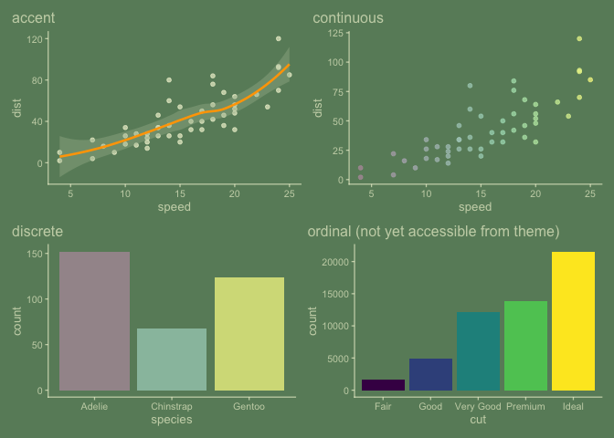

# Derivative themes: blackboard, slateboard, glassboard …

``` r
#' @export
theme_blackboard <- function(paper = "grey20",
                             ink = alpha("whitesmoke", .6),
                             accent = alpha("palevioletred3", .8),
                             base_size = 18,
                             base_theme = theme_chalkboard,
                      ...){
  
  theme_chalkboard(paper = paper, ink = ink, accent = accent, 
                   base_size = base_size,  ...)
  
}
```

``` r
theme_set(theme_blackboard(base_size = 10))

patchwork_ensemble
```

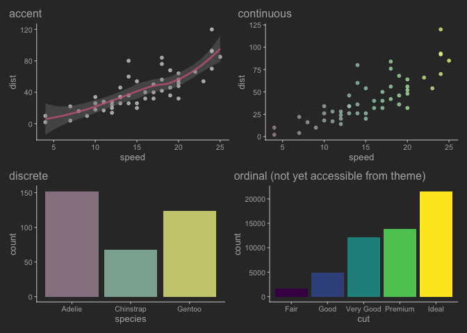

``` r
#' @export
theme_slateboard <- function(paper = "lightskyblue4",
                             ink = alpha("whitesmoke", .6),
                             accent = alpha("palevioletred3", .8),
                             base_size = 18,
                             base_theme = theme_chalkboard,
                      ...){
  
  theme_chalkboard(paper = paper, ink = ink, base_size = base_size, 
                   accent = accent, ...)
  
}
```

``` r
theme_set(theme_slateboard(base_size = 10))

patchwork_ensemble
```

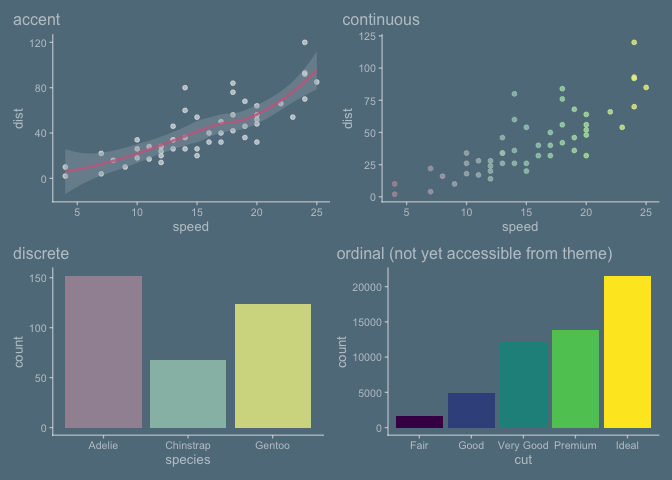

``` r
#' @export
theme_glassboard <- function(paper = alpha("white", 0), # transparent
                             ink = alpha("black", .7),
                             accent = alpha("darkred", .7),
                             base_size = 18,
                             base_theme = ggplot2::theme_classic,
                      ...){
  
  base_theme(paper = paper, ink = ink, accent = accent, 
             base_size = base_size, ...)
  
}
```

``` r
theme_set(theme_glassboard(base_size = 10))

patchwork_ensemble
```

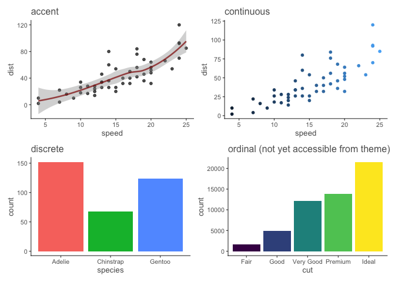

``` r
theme_rosling <- function(paper = alpha("black", .9), ink = "cadetblue2", 
                          accent = "orange", 
                          base_size = 20,
                          base_theme = theme_classic,
                          palette.colour.continuous = 
                            viridis_pal_c(option = "viridis", begin = .4),
                          palette.fill.continuous = 
                            viridis_pal_c(option = "viridis", begin = .4),
                          palette.colour.discrete = 
                            viridis_pal_d(colmix = "cadetblue1", amount = .2, 
                                          alpha = 1),
                          palette.fill.discrete = 
                            viridis_pal_d(colmix = "cadetblue1", amount = .5, 
                                          alpha = 1),
                          
                        ...){
  
  theme_chalkboard(paper = paper, ink = ink, accent = accent, base_theme = base_theme,
          base_size = base_size,
          palette.colour.continuous = palette.colour.continuous, 
          palette.fill.continuous = palette.fill.continuous,
          palette.colour.discrete = palette.colour.discrete,
          palette.fill.discrete = palette.fill.discrete
          )
  
}
```

``` r
theme_set(theme_rosling(base_size = 10))

patchwork_ensemble
```

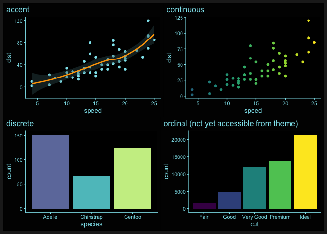

# Minimal working package

``` r
devtools::create(".")
```

## Moved functions R folder

``` r
#knitrExtra::chunk_names_get()
usethis::use_package("ggplot2")

knitrExtra:::chunk_to_r("theme_chalkboard")
knitrExtra:::chunk_to_r("theme_blackboard")
knitrExtra:::chunk_to_r("theme_whiteboard")
knitrExtra:::chunk_to_r("theme_slateboard")
knitrExtra:::chunk_to_r("theme_glassboard")
```

## check and install

``` r
devtools::check(pkg = ".")
devtools::install(pkg = ".", upgrade = "never") 
```

# More considerations

## colorblindness colorblindr

`remotes::install_github("clauswilke/colorblindr")`

``` r

(patchwork_ensemble &
  theme_chalkboard()) |> 
  colorblindr::cvd_grid()
```


A test with colorblindr

Color and fill scale are probably of greater interest, I know. Something
to come back to.

## looking to the future… consider Joseph Lamarange’s work!? `safe_pal`

``` r

ma <- function(x,  b = "lightyellow", amount = .5, alpha = .8){
  
  x |> scales::col_mix(b, amount) |> alpha(alpha)
  
}

safe_pal_mixer <- function (reverse = FALSE, b = "lightyellow", amount = .5, alpha = .8) 
{
    function(n) {
        rlang::check_installed("khroma")
        if (n <= 6 && !reverse) 
            return((khroma::color("bright"))(n) |> ma(b = b, amount = amount, alpha = alpha))
        if (n <= 6 && reverse) {
            col <- (khroma::color("bright", reverse = TRUE))(n + 
                1)
            return(col[2:(n + 1)]  |> ma(b = b, amount = amount, alpha = alpha))
        }
        if (n %in% 7:9) 
            return((khroma::color("muted", reverse = reverse))(n) |> ma(b = b, amount = amount, alpha = alpha))
        set.seed(42)
        if (n <= 23) 
            return(sample((khroma::color("discrete rainbow", 
                reverse = reverse))(n)) |> ma(b = b, amount = amount, alpha = alpha))
        sample((khroma::color("smooth rainbow", reverse = reverse))(n) |> ma(b = b, amount = amount, alpha = alpha))
    }
}
```

## Considerations for extenders…

What can be done about layer from a ggplot2 extension that has hard
coded aesthetic defaults?

``` r
library(ggplot2)
library(ggalluvial)

GeomStratum$default_aes # hardcoded
#> $size
#> [1] 0.5
#> 
#> $linewidth
#> [1] 0.5
#> 
#> $linetype
#> [1] 1
#> 
#> $colour
#> [1] "black"
#> 
#> $fill
#> [1] "white"
#> 
#> $alpha
#> [1] 1
#> 
#> attr(,"class")
#> [1] "uneval"

titanic_flat <- data.frame(Titanic)

ggplot(data = titanic_flat) + # Ok Lets look at this titanic data
  aes(y = Freq, axis1 = Sex, axis2 = Survived) + # Here some variables of interest
  ggchalkboard:::theme_chalkboard(base_size = 18) + # in a alluvial plot first look
  geom_alluvium() + # And we are ready to look at flow
  geom_stratum() + # And we can label our stratum axes
  stat_stratum(geom = "text", aes(label = after_stat(stratum))) 
```

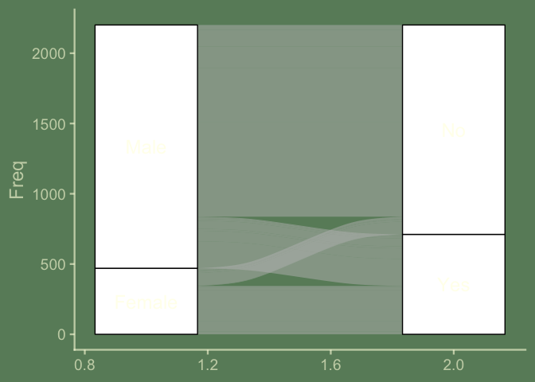

``` r

# Step 1.  Look at dynamic default aes from base ggplot2 for reference
GeomRect$default_aes
#> Aesthetic mapping: 
#> * `colour`    -> `from_theme(colour %||% NA)`
#> * `fill`      -> `from_theme(fill %||% col_mix(ink, paper, 0.35))`
#> * `linewidth` -> `from_theme(borderwidth)`
#> * `linetype`  -> `from_theme(bordertype)`
#> * `alpha`     -> NA

# Step 2. Update defaults as required.
GeomStratum$default_aes <- aes(color = from_theme(ink),
                               fill = from_theme(paper),
                               linewidth = from_theme(borderwidth),
                               linetype = from_theme(bordertype),
                               alpha = NA)

# Alternative Step 2  An in-script, alternative could look like this
aes_update <- aes(color = from_theme(ink))
GeomStratum$default_aes <- GeomRect$default_aes |> modifyList(aes_update)


geom_stratum
#> function (mapping = NULL, data = NULL, stat = "stratum", position = "identity", 
#>     show.legend = NA, inherit.aes = TRUE, width = 1/3, na.rm = FALSE, 
#>     ...) 
#> {
#>     layer(geom = GeomStratum, mapping = mapping, data = data, 
#>         stat = stat, position = position, show.legend = show.legend, 
#>         inherit.aes = inherit.aes, params = list(width = width, 
#>             na.rm = na.rm, ...))
#> }
#> <bytecode: 0x1371b8320>
#> <environment: namespace:ggalluvial>

ggplot(data = titanic_flat) + # Ok Lets look at this titanic data
  aes(y = Freq, axis1 = Sex, axis2 = Survived) + # Here some variables of interest
  ggchalkboard::theme_chalkboard(base_size = 18) + # in a alluvial plot first look
  geom_alluvium() + # And we are ready to look at flow
  geom_stratum() + # And we can label our stratum axes
  stat_stratum(geom = "text", aes(label = after_stat(stratum))) 
```

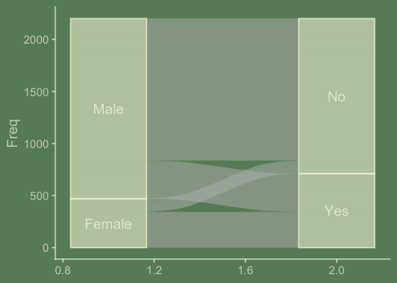
